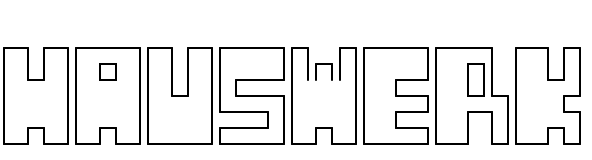

📘 Deze pagina is ook beschikbaar in het [Engels](./README_EN.md)

<p align="center">
  
</p>

# 🏗️ Hauswerk

**Hauswerk** is een grafische toolkit voor makers die graag hun eigen media-tools willen bouwen — zonder dat daar veel programmeerwerk aan te pas komt. De applicatie draait op Python en PyQt6, en biedt een modulaire omgeving waarin je visueel je eigen plugins kunt samenstellen: van video-collage generators en audio-stretchers tot experimentele glitch-interfaces.

Of je nu een videokunstenaar bent die fragmenten wil combineren, een muzikale programmeur met een liefde voor obscure automatisering, of gewoon iemand die zijn eigen creatieve tools wil vormgeven — Hauswerk geeft je de ruimte om het zelf te maken.

---

## 🧰 Wat zit er in deze toolkit?

Hauswerk wordt geleverd als een volledige desktopapplicatie voor Linux, gebouwd op PyQt6, met een modulair systeem van plugins. De interface bestaat uit verschillende tabs, waaronder:

- **Collage**: stel videocomposities samen uit meerdere bronnen
- **Concat**: plak video’s aan elkaar met fades of crossfades
- **Clipper**: knip willekeurige segmenten uit je materiaal
- **Stretcher**: vertraag video (inclusief audio)
- **Quantizer+** en **Psychotisch**: meer experimentele tools

Elke plugin is los opgebouwd en wordt automatisch geladen via de `widgets/`-map.

Naast de tools zelf bevat Hauswerk:

- Een **visuele UI Builder** in een 2×6 grid-systeem waarmee je eigen tools kunt ontwerpen via drag & drop
- Een **AI-assistent** die op basis van een tekstprompt suggesties doet voor plugin-layouts
- **Terminal-integratie**: een ingebouwd consolevenster waarin je commando’s kunt uitvoeren en log-output van tools kunt bekijken
- **Thema-ondersteuning**: licht en donker, aanpasbaar via instellingen
- **Linux-integratie**: met `.desktop` launcher en PyInstaller `.spec` bestand voor distributie

---

## 🖼️ Structuur van het project

Alle code is modulair opgezet:

```plaintext
hauswerk/
│
├── __main__.py                  # Startpunt van de GUI
├── core/                        # Kernfunctionaliteit (settings, stijl, AI, etc.)
├── widgets/                     # Plugins per tool (bv. collage.py)
├── resources/icons/             # SVG-iconen
├── light.qss / dark.qss         # Qt stylesheets
├── ui_builder_ai_labels.py      # De visuele UI-bouwer
├── hauswerk.desktop             # Launcher voor Linux
├── Hauswerk.spec                # PyInstaller config
└── hauswerk_ascii.txt           # ASCII splash logo
```

---

## 🚀 Aan de slag

### 1. Download het project

```bash
git clone https://github.com/jouwhandle/hauswerk.git
cd hauswerk
```

### 2. Optioneel: zet een virtual environment op

```bash
python -m venv venv
source venv/bin/activate  # Windows: .\venv\Scripts\activate
```

### 3. Installeer de benodigde pakketten

```bash
pip install -r requirements.txt
```

### 4. Start de GUI

```bash
python __main__.py
```

---

## 🤖 Ontwerpen met AI

In de UI Builder kun je aangeven wat je wilt bouwen via een simpele prompt, bijvoorbeeld:

> "Maak een tool voor het analyseren van audio met voortgangsbalk en logoutput"

De assistent stelt dan layouts voor met bijvoorbeeld:
- QLabel (voor tekst)
- QSlider (instelbare waarde)
- QPushButton (actieknop)
- QProgressBar (voortgang)
- QTextEdit (voor logregels)

Je kunt de beste suggestie kiezen, eventueel aanpassen, en direct exporteren als werkende `.py`-plugin.

---

## 📦 Plugins genereren

Nadat je een layout ontworpen hebt in de builder:

1. Klik op **Genereer plugin**
2. Geef een naam op (bijvoorbeeld `wave_glitch`)
3. Het bestand wordt opgeslagen in `widgets/`
4. Na een herstart van Hauswerk verschijnt je plugin als nieuwe tab

---

## 💬 Terminalvenster

De ingebouwde terminal maakt Hauswerk extra krachtig. Hier kun je:

- Commando’s uitvoeren zoals `help`, `clear`, of `run test`
- Logging ontvangen van plugins (indien `set_terminal()` gebruikt wordt)
- Output en foutmeldingen direct volgen in de GUI

---

## 🔧 Aanpassen en uitbreiden

Hauswerk is ontworpen om te hacken en aan te passen. Je kunt bijvoorbeeld:

- Nieuwe plugins maken in de `widgets/` map
- Het AI-suggestiesysteem uitbreiden
- Je eigen visuele thema’s toevoegen (via `.qss`)
- Icons aanpassen of toevoegen in `resources/icons`

---

## 📜 Licentie

Hauswerk is open source onder de **MIT-licentie**. Je mag het gebruiken, aanpassen, en delen — zolang je de originele licentie respecteert.
